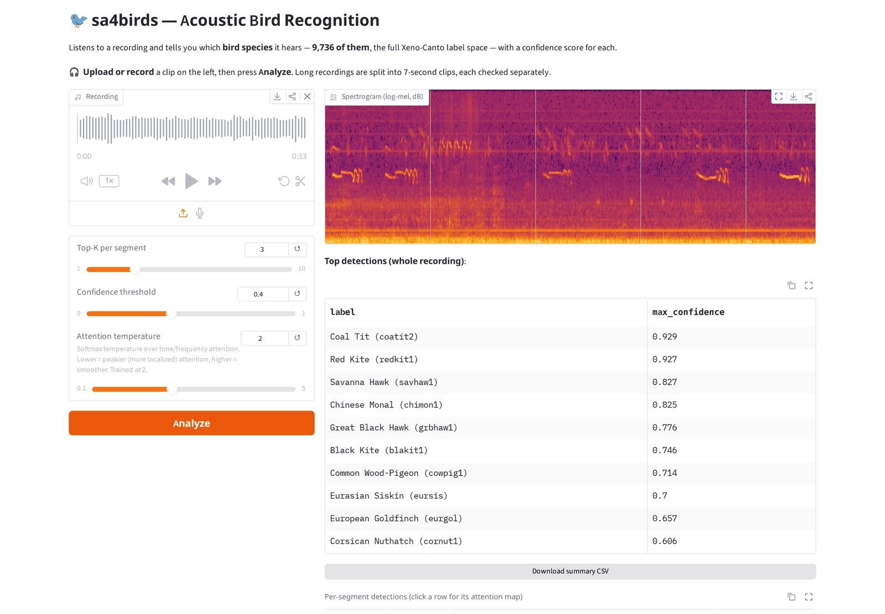

# Automated Recognition of Bird Species in Environmental Soundscapes Using Spectrogram Attention

[](https://www.python.org/)
[](https://pytorch.org/get-started/locally/)
[](https://github.com/jab2026/sa4birds/releases/tag/v1.0)
[](https://huggingface.co/datasets/DBD-research-group/BirdSet)
[](#web--edge-applications)

Official implementation of the paper *Automated Recognition of Bird Species in
Environmental Soundscapes Using Spectrogram Attention*.

**SA4Birds** recognises bird species in soundscape recordings. It adds a
**spectrogram attention** head to a pretrained convolutional encoder. For every
species, the head learns where in the log-mel spectrogram to look, across both
time and frequency, and uses that to score the clip. Each prediction therefore
comes with a map of the time–frequency region it was based on. The head comes in
two variants: a dual-branch version (**DSA**) that combines a fine and a coarse
view of the spectrogram, and a lighter single-branch version (**SSA**) that
performs almost the same.

The encoder is pretrained on Xeno-Canto recordings of **9,736 bird species**. The
model is then fine-tuned for the **eight BirdSet tasks**, on Xeno-Canto training
data, and evaluated on their soundscape test sets under three training regimes: dedicated to one task's species, medium (707 species) and large
(all 9,736). With the encoder frozen, it also transfers to other animal sounds in
the BEANS benchmark.

This repository contains:
- All released checkpoints.
- The evaluation scripts and notebooks that reproduce the paper's results.
- A script for fine-tuning on your own recordings.
- Two ready-to-run applications: a browser app and an offline tool for a Raspberry Pi.

All results from the paper, for BirdSet and BEANS, are in
**[RESULTS.md](RESULTS.md)**.

---

## Table of Contents

- [Project Structure](#project-structure)
- [Web & Edge Applications](#web--edge-applications)
- [Model Demo in Jupyter](#model-demo-in-jupyter)
- [Requirements](#requirements)
- [Checkpoints](#checkpoints)
- [Fine-tuning on your own data](#fine-tuning-on-your-own-data)
- [Datasets](#datasets)
- [Validation](#validation)
- [Results](RESULTS.md)


---

## Project Structure

```
sa4birds/
│
├── sa4birds/                               # Importable package
│   ├── models/                             # DSA, SSA and baseline architectures
│   ├── utils/                              # Frontend, event decoding, metrics
│   └── evaluation.py                       # BirdSet evaluation helpers
│
├── apps/
│   ├── web/                                # Gradio web app (onnxruntime, no torch)
│   └── edge/                               # Offline CLI for ARM / Raspberry Pi
│
├── notebooks/                              # Example notebooks
│   ├── model_demo.ipynb                    # Demonstrates model usage
│   ├── evaluation_birdset.ipynb            # Evaluation on all BirdSet downstream tasks
│   ├── evaluation_ablation_study.ipynb     # Ablation study experiments
│   └── evaluation_beans.ipynb              # Transfer learning on the BEANS benchmark
│
├── assets/                                 # Taxonomies and figures
├── ckpts/                                  # Pretrained model checkpoints (downloaded)
│
├── validate_birdset.py                     # Evaluation entry point
├── finetune_custom.py                      # Fine-tune a checkpoint on your own labelled audio
├── export_onnx.py                          # .pth checkpoint -> ONNX, for the two apps
├── registry.py                             # Checkpoint paths per training regime
│
├── requirements.txt                        # Python dependencies
├── FINETUNING.md                           # Fine-tuning on your own data
├── VALIDATION.md                           # Reproducing the BirdSet/BEANS results
├── RESULTS.md                              # All results from the paper
├── LICENCE
└── README.md                               # Project documentation
```


**Note:**  
For all notebooks provided in the `notebooks/` directory, we also uploaded the cell outputs corresponding to the expected results. This allows users to inspect the expected outputs without rerunning the full experiments, which can require significant computational resources and large datasets.

---

## Web & Edge Applications

Two standalone applications ship with this repository, for running a trained
model. Both serve an **ONNX export** of a checkpoint and run on `onnxruntime` — neither imports torch, neither needs a
GPU, and neither needs the environment in [Requirements](#requirements):

| | |
|---|---|
| **[`apps/web/`](apps/web/)** | A Gradio web app: upload or record audio, inspect per-segment predictions, and visualize the attention maps behind them. GPU optional. → [README](apps/web/README.md) |
| **[`apps/edge/`](apps/edge/)** | A headless CLI for running the model fully offline on an ARM single-board computer such as a Raspberry Pi, including live inference from a USB microphone. → [README](apps/edge/README.md) |

<div align="center">
  
</div>

### Exporting a model for them

The export both applications are built around (LT with the single-branch SSA
head) is on the release as `sa4birds-LT-SSA-onnx.tar`; see
[Checkpoints](#checkpoints). To serve any other checkpoint, download it and
convert it once with `export_onnx.py`. Exporting needs PyTorch and the `onnx`
package, both installed with the project's dependencies
([Requirements](#requirements)). The applications themselves only need
`onnxruntime`. For example, this rebuilds the released export from
`sa4birds-LT-SSA.tar`, byte for byte:

```bash
python export_onnx.py --ckpt ckpts/LT/ssa_LT_seed1/models/model.pth \
                      --out ckpts/onnx/ssa_LT_seed1 --ir-version 9
```

`--ir-version 9` keeps the file loadable on the Raspberry Pi (see
[apps/edge](apps/edge/README.md)).

This writes `model.onnx` and `metadata.json` (class names, spectrogram
settings, trained temperature and fuse weight). Newer PyTorch versions also
store the weights in a separate `model.onnx.data`; keep it next to
`model.onnx`. Before exporting, the script checks that the model it exports
reproduces the checkpoint's predictions, and stops if they differ by more than
rounding error. Both DSA and SSA checkpoints are supported.

Each application's README covers its own setup and options.

---

## Model Demo in Jupyter

```bash
pip install jupyterlab
jupyter lab
```

Then open [`notebooks/model_demo.ipynb`](notebooks/model_demo.ipynb). It runs an LT
model on an audio file of your choice (a Xeno-Canto recording by default) and
prints the most likely species in its first 7 seconds. It needs the [Requirements](#requirements) and
`sa4birds-LT-DSA.tar` ([Checkpoints](#checkpoints)).

---

## Requirements

This project requires **Python 3.9–3.12** (tested with 3.12). A CUDA GPU is recommended for evaluation
and fine-tuning, but is not required to run the models: the two applications in
[`apps/`](apps/) serve the same 9,736-class model on CPU through onnxruntime,
one of them on a Raspberry Pi.

### System Requirements
- **Python:** 3.9–3.12. The pinned PyTorch 2.2 has no builds for 3.13.
- **GPU (optional):** NVIDIA GPU with CUDA support, plus drivers — see
  [VALIDATION.md](VALIDATION.md) for the VRAM and disk needed to reproduce the
  benchmarks

### Install Python Dependencies
After cloning the repository, navigate into the project directory:

```bash
git clone https://github.com/jab2026/sa4birds.git
cd sa4birds
```

The project relies on the following main packages (see `requirements.txt` for the complete list):
```text
datasets
librosa
numpy
omegaconf
onnx
scikit-learn
soundfile
timm
torch
torchaudio
torchmetrics
torchvision
transformers
```
Create a Python virtual environment and activate it:
```bash
python3 -m venv venv
source venv/bin/activate
```

Install the required Python packages listed in **`requirements.txt`**:

```bash
pip install -r requirements.txt
```

### Disk space

The BirdSet checkpoints need about **8.4 GB** across all regimes, the BEANS
checkpoints another **6.4 GB** and the ablation checkpoints **9.9 GB**. The benchmark
datasets are far larger — roughly **160 GB** for BirdSet and **320 GB** for
BEANS — but are only needed for evaluation.


## Checkpoints

Our checkpoints are published as assets on the
**[v1.0 release](https://github.com/jab2026/sa4birds/releases/tag/v1.0)**:
33 for BirdSet (8.4 GB), 30 for BEANS (6.4 GB), 54 for the ablations (9.9 GB)
and a 0.54 GB ONNX export.

| Regime | Description                               | Assets                                          | Size     |
|--------|-------------------------------------------|-------------------------------------------------|----------|
| **DT** | Dedicated training (task-specific models) | `sa4birds-DT-<TASK>.tar`, one per BirdSet task  | ~650 MB each |
| **MT** | Medium training                           | `sa4birds-MT.tar`                               | 0.69 GB  |
| **LT (DSA)** | Large training, knowledge-distilled | `sa4birds-LT-DSA.tar`                         | 1.31 GB  |
| **LT (SSA)** | LT with the single-branch SSA head         | `sa4birds-LT-SSA.tar`                     | 1.21 GB  |
| **ONNX** | LT with the SSA head, exported for `apps/web` and `apps/edge` | `sa4birds-LT-SSA-onnx.tar` | 0.54 GB  |
| **BEANS** | Frozen pretrained encoder with a DSA head trained per BEANS task | `sa4birds-BEANS-<task>.tar`, one per task | ~660 MB each |
| **Ablations** | Models behind the classifier-head comparison and the HSN ablations | `sa4birds-ablation-<VARIANT>[-<TASK>].tar` | 440–660 MB each |

Each regime holds **three independently trained runs**, which are averaged during
evaluation. The three LT SSA models are not trained separately: each is the
fine-grained branch of the DSA LT model with the same seed. The ONNX export is
built from `ssa_LT_seed1`. Download only the regimes you intend to evaluate — for
DT you can also take a single task rather than all eight. The ONNX archive is only needed to run
the web or edge app, which do not use PyTorch.

The BEANS archives hold three seeds for each of the ten tasks in the paper:
`watkins`, `bats`, `cbi`, `dogs`, `humbugdb`, `speech`, `enabirds`, `hiceas`,
`rfcx` and `hainan_gibbons` (e.g. `sa4birds-BEANS-watkins.tar` ->
`ckpts/beans/watkins/dsa_watkins_seed{1,2,3}`). Their configs also keep the
evaluation batch size (64) the reported numbers were measured with.

The ablation archives hold three seeds each. The alternative classifier heads
(`linear_head`, `time_attention_head`, `ssa_head`) have one archive per task
(HSN, POW, NES, UHH), e.g. `sa4birds-ablation-linear_head-POW.tar` ->
`ckpts/ablation/linear_head/linear_POW_seed{1,2,3}`. The HSN-only ablations
(`no_secondary_labels`, `aug_none`, `aug_signal_mixup`, `aug_bg_noise`,
`aug_colored_noise_gain`, `aug_no_call`) have one archive each, e.g.
`sa4birds-ablation-aug_none.tar`.

Every `model.pth` is a `{"state_dict", "config"}` pair, and the config is reduced
to what inference reads: the spectrogram frontend, the architecture, and the
label map. It carries no training hyperparameters and no paths from the machine
the run was trained on.

The archives carry their paths relative to the project root, so extracting them
from there puts the BirdSet checkpoints exactly where `registry.py` looks for
them, and the BEANS and ablation checkpoints where their notebooks look for
them:

```bash
BASE=https://github.com/jab2026/sa4birds/releases/download/v1.0

curl -LO $BASE/sa4birds-LT-DSA.tar             # one regime
curl -LO $BASE/sa4birds-DT-HSN.tar             # one DT task
tar -xf sa4birds-LT-DSA.tar -C .               # -> ckpts/LT/dsa_LT_seed1/models/model.pth

# all of DT, MT and LT in one go (~8.4 GB)
for a in DT-HSN DT-NBP DT-NES DT-PER DT-POW DT-SNE DT-SSW DT-UHH MT LT-DSA LT-SSA; do
  curl -LO $BASE/sa4birds-$a.tar && tar -xf sa4birds-$a.tar -C . && rm sa4birds-$a.tar
done
```

Verify the downloads against the release's `SHA256SUMS.txt`:

```bash
curl -LO $BASE/SHA256SUMS.txt
sha256sum -c SHA256SUMS.txt --ignore-missing
```

This lays out the `ckpts` directory as follows:

```
sa4birds/
│
├── ckpts/                         # pretrained model checkpoints
│   ├── DT/
│   │   ├── HSN/                             # downstream task name
│   │   │   ├── dsa_HSN_seed1/models/model.pth   # <head>_<task>_seed<N>
│   │   │   └── ...
│   │   └── ...                                  # other downstream tasks
│   ├── MT/
│   │   ├── dsa_MT_seed1/                        # MT, first of three runs
│   │   └── ...
│   ├── LT/
│   │   ├── dsa_LT_seed1/                        # LT, first of three runs
│   │   ├── ...
│   │   ├── ssa_LT_seed1/                        # LT with the SSA head, seed 1
│   │   └── ...
│   ├── onnx/
│   │   └── ssa_LT_seed1/                        # ONNX export used by apps/web and apps/edge
│   ├── beans/
│   │   ├── watkins/
│   │   │   ├── dsa_watkins_seed1/               # BEANS task, first of three runs
│   │   │   └── ...
│   │   └── ...                                  # other BEANS tasks
│   └── ablation/
│       ├── linear_head/
│       │   ├── linear_HSN_seed1/                # ablation variant on HSN, first of three runs
│       │   └── ...
│       └── ...                                  # other ablation variants
```


## Fine-tuning on your own data

`finetune_custom.py` adapts a released checkpoint to your own labelled audio.
Describe the data in a CSV of `path,labels`, point the script at it, and the
result exports and serves exactly like a released checkpoint:

```bash
python finetune_custom.py --csv mydata.csv --out ckpts/custom/my_run --freeze-backbone
```

See **[FINETUNING.md](FINETUNING.md)** for the CSV format, the full option list,
and what the training actually does.

---

## Datasets

### BirdSet
Training and evaluation primarily rely on the **[BirdSet](https://github.com/DBD-research-group/BirdSet)** benchmark.

BirdSet contains eight downstream tasks, each consisting of:

- **Training data:** weakly labeled recordings from **Xeno-Canto**
- **Test data:** strongly annotated **regional soundscapes**

For details see the **[BirdSet paper](https://arxiv.org/abs/2403.10380)**.

BirdSet tasks will be automatically downloaded via the Hugging Face `datasets` library during the testing phase if they are not already present, using:

```python
import datasets 

down_task = "HSN"
datasets.load_dataset("DBD-research-group/BirdSet", down_task, trust_remote_code=True)
```

Cached datasets are stored in:

```
~/.cache/huggingface/
```

### BEANS

For transfer learning experiments, we use the **BEANS benchmark**, which consists of different downstream tasks related to various animal sounds, such as bats. For more details, see [BEANS](https://github.com/earthspecies/beans).

---

## Validation

Reproduce the paper's BirdSet numbers (BEANS: [`notebooks/evaluation_beans.ipynb`](notebooks/evaluation_beans.ipynb)):

```bash
python validate_birdset.py --mode=DT --down_task=HSN
python validate_birdset.py --mode=LT --down_task=ALL
```

Each regime holds three independently trained runs, and the reported metric is
their mean. See **[VALIDATION.md](VALIDATION.md)** for the regimes, the full
option list, the metrics, and the dataset/GPU requirements.
**[RESULTS.md](RESULTS.md)** lists every number these commands and the
notebooks reproduce.
