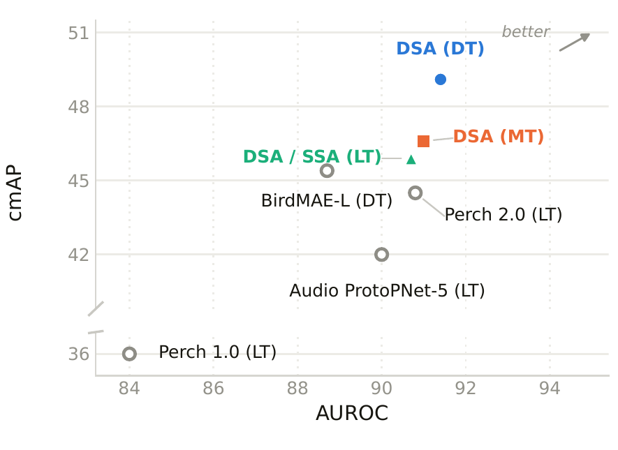
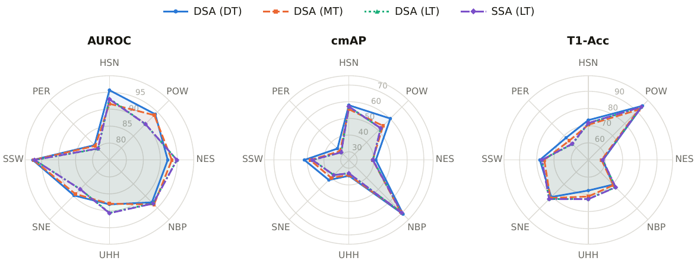
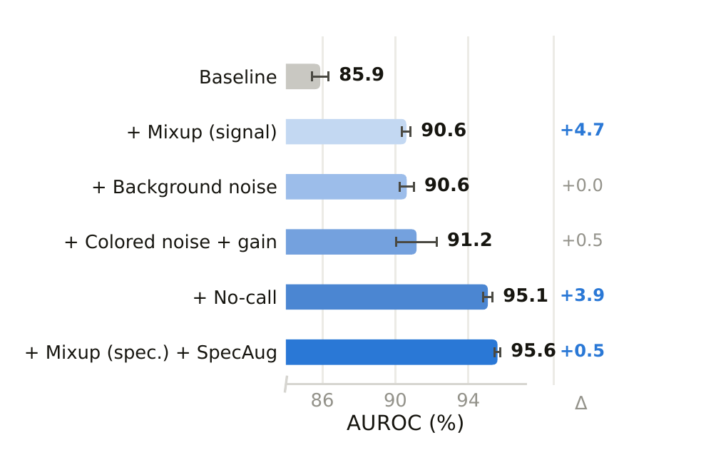

# Results

All numbers are from the paper *Automated Recognition of Bird Species in
Environmental Soundscapes Using Spectrogram Attention*. Unless noted otherwise,
each value is the **mean over three training seeds**; the paper also gives the
standard deviations.
Each table that can be reproduced from the released checkpoints says how.

- [BirdSet: comparison with published methods](#birdset-comparison-with-published-methods)
- [BirdSet: per task and training regime](#birdset-per-task-and-training-regime)
- [Classifier heads](#classifier-heads)
- [Ablations on HSN](#ablations-on-hsn)
- [Transfer to other animal sounds (BEANS)](#transfer-to-other-animal-sounds-beans)
- [Independent test set: comparison with BirdNET (FVA)](#independent-test-set-comparison-with-birdnet-fva)
- [Inference speed](#inference-speed)
- [How the numbers are computed](#how-the-numbers-are-computed)

Model names: **DSA** is the dual-branch spectrogram attention head and **SSA** the
single-branch one. **DT**, **MT** and **LT** are the three BirdSet training regimes:
dedicated (one model per task, 21–132 species), medium (707 species) and large
(9,736 species). See the [README](README.md) for the architecture.

---

## BirdSet: comparison with published methods

Mean over the eight BirdSet test sets.

| Method | AUROC | cmAP | T1-Acc |
|---|---|---|---|
| Audio ProtoPNet-5 (LT) | 0.900 | 0.420 | 0.620 |
| BirdMAE-L (DT) | 0.887 | 0.454 | 0.640 |
| Perch (LT) | 0.840 | 0.360 | 0.610 |
| Perch 2.0 (LT) | 0.908 | 0.445 | 0.698 |
| **DSA (DT)** | **0.914** | **0.491** | **0.739** |
| DSA (MT) | 0.910 | 0.466 | 0.730 |
| DSA (LT) | 0.907 | 0.459 | 0.739 |
| SSA (LT) | 0.907 | 0.459 | 0.739 |

<p align="center"></p>

Compared with the best published value for each metric, DSA (DT) improves AUROC
by 0.66%, cmAP by 8.15% and T1-Acc by 5.87% (relative). The AUROC margin over
Perch 2.0 is small (0.914 against 0.908): about three times the seed-to-seed
standard deviation, so the ordering is stable, but most of the improvement is in
cmAP and T1-Acc.

BirdNET is not in this table. The BirdSet authors exclude it because its
training data may overlap with the BirdSet test recordings, and we follow that
protocol. A direct comparison on an independent dataset is
[below](#independent-test-set-comparison-with-birdnet-fva).

---

## BirdSet: per task and training regime

**AUROC**

| Model | HSN | POW | NES | NBP | UHH | SNE | SSW | PER | Mean |
|---|---|---|---|---|---|---|---|---|---|
| DSA (DT) | **0.956** | **0.941** | 0.922 | 0.927 | 0.881 | **0.898** | **0.976** | **0.812** | 0.914 |
| DSA (MT) | 0.916 | 0.937 | 0.934 | **0.936** | 0.879 | 0.892 | 0.974 | 0.809 | 0.910 |
| DSA (LT) | 0.931 | 0.900 | **0.949** | 0.931 | 0.906 | 0.872 | 0.971 | 0.797 | 0.907 |
| SSA (LT) | 0.929 | 0.900 | **0.949** | 0.932 | **0.907** | 0.872 | 0.971 | 0.798 | 0.907 |

**cmAP**

| Model | HSN | POW | NES | NBP | UHH | SNE | SSW | PER | Mean |
|---|---|---|---|---|---|---|---|---|---|
| DSA (DT) | **0.579** | **0.602** | **0.412** | **0.710** | **0.345** | **0.420** | **0.517** | **0.347** | 0.491 |
| DSA (MT) | 0.555 | 0.540 | 0.393 | 0.689 | 0.341 | 0.401 | 0.482 | 0.325 | 0.466 |
| DSA (LT) | 0.570 | 0.520 | 0.395 | 0.699 | 0.330 | 0.378 | 0.468 | 0.315 | 0.459 |
| SSA (LT) | 0.571 | 0.520 | 0.394 | 0.699 | 0.330 | 0.378 | 0.469 | 0.315 | 0.459 |

**T1-Acc**

| Model | HSN | POW | NES | NBP | UHH | SNE | SSW | PER | Mean |
|---|---|---|---|---|---|---|---|---|---|
| DSA (DT) | **0.732** | **0.946** | **0.585** | 0.703 | 0.678 | 0.805 | **0.782** | **0.683** | 0.739 |
| DSA (MT) | 0.705 | 0.915 | 0.577 | 0.707 | 0.713 | 0.813 | 0.756 | 0.658 | 0.730 |
| DSA (LT) | 0.714 | 0.937 | 0.584 | 0.724 | 0.727 | **0.822** | 0.770 | 0.631 | 0.739 |
| SSA (LT) | 0.715 | 0.937 | 0.584 | **0.725** | **0.728** | **0.822** | 0.770 | 0.633 | 0.739 |

Bold marks the best model per task and metric.

<p align="center"></p>

No regime wins everywhere. Dedicated training is strongest on cmAP for every task
and has the best mean AUROC and cmAP, so when the target species are known in
advance, fine-tuning on that set is the better choice. The large-regime models are
competitive on AUROC and T1-Acc for several soundscape tasks. The four models rise
and fall on the same tasks, which suggests that how hard a task is depends on the
dataset more than on the training regime.

**Reproduce.** Download the checkpoints ([Checkpoints](README.md#checkpoints)), then:

```bash
python validate_birdset.py --mode=DT     --down_task=ALL   # sa4birds-DT-<TASK>.tar
python validate_birdset.py --mode=MT     --down_task=ALL   # sa4birds-MT.tar
python validate_birdset.py --mode=LT     --down_task=ALL   # sa4birds-LT-DSA.tar
python validate_birdset.py --mode=LT_SSA --down_task=ALL   # sa4birds-LT-SSA.tar
```

[`notebooks/evaluation_birdset.ipynb`](notebooks/evaluation_birdset.ipynb) runs
the same evaluation and keeps its outputs for all four models.

---

## Classifier heads

Four heads on the same encoder, trained with the same data and augmentation.
Mean over three seeds; the Mean column averages the four tasks.

| Head | Metric | HSN | POW | NES | UHH | Mean |
|---|---|---|---|---|---|---|
| Linear | AUROC | 0.926 | 0.921 | 0.903 | 0.857 | 0.902 |
| | cmAP | 0.552 | 0.592 | **0.417** | 0.346 | 0.477 |
| | T1-Acc | 0.673 | **0.952** | 0.578 | 0.678 | 0.720 |
| Time attention | AUROC | 0.946 | 0.927 | 0.920 | 0.835 | 0.907 |
| | cmAP | **0.585** | 0.602 | 0.403 | 0.332 | 0.481 |
| | T1-Acc | 0.705 | 0.948 | **0.596** | 0.655 | 0.726 |
| **DSA** | AUROC | **0.956** | **0.941** | **0.922** | 0.881 | **0.925** |
| | cmAP | 0.579 | 0.602 | 0.412 | 0.345 | 0.485 |
| | T1-Acc | **0.732** | 0.946 | 0.585 | **0.678** | **0.735** |
| **SSA** | AUROC | 0.955 | 0.937 | 0.918 | **0.882** | 0.923 |
| | cmAP | 0.584 | **0.604** | 0.415 | **0.350** | **0.488** |
| | T1-Acc | 0.724 | 0.945 | 0.588 | 0.657 | 0.729 |

The linear head is evaluated on 5 s windows; the attention heads use a 7 s window
and score its centre 5 s, since only they can make use of the extra context.
No head wins on every task, but averaged over the four, both spectrogram-attention
heads beat the linear and time-attention baselines. DSA has the best mean AUROC and
T1-Acc, and SSA the best mean cmAP.

**Reproduce.** The DSA rows are the released DT checkpoints (see the regime table
above). All four heads on all four tasks are in
[`notebooks/evaluation_ablation_study.ipynb`](notebooks/evaluation_ablation_study.ipynb),
section 1; the other heads' checkpoints are on the release as
`sa4birds-ablation-<head>_head-<TASK>.tar`.

---

## Ablations on HSN

HSN was the development set: every design choice below was made on it before the
final models were trained on the other tasks. All rows are DSA (DT), mean over
three seeds; the chosen setting is in bold.

**Secondary labels and test window**

| Setting | AUROC | cmAP | T1-Acc |
|---|---|---|---|
| Secondary label weight 0.0 | 0.950 | 0.562 | 0.718 |
| **Secondary label weight 0.9** | **0.956** | **0.579** | **0.732** |
| Test window 5 s | 0.952 | **0.579** | 0.719 |
| **Test window 7 s** (centre 5 s scored) | **0.956** | **0.579** | **0.732** |

**Data augmentation.** Cumulative: each row adds one augmentation to all the rows above it.

| Augmentation | AUROC | cmAP | T1-Acc |
|---|---|---|---|
| None | 0.859 | 0.525 | 0.642 |
| + Mixup (signal) | 0.906 | 0.545 | 0.715 |
| + Background noise | 0.906 | 0.552 | 0.720 |
| + Coloured noise + gain | 0.912 | 0.552 | 0.726 |
| + No-call samples | 0.951 | 0.580 | 0.724 |
| + Mixup (spectrogram) + SpecAugment | 0.956 | 0.579 | 0.732 |

<p align="center"></p>

**Reproduce.** [`notebooks/evaluation_ablation_study.ipynb`](notebooks/evaluation_ablation_study.ipynb)
(sections 2, 3 and 4). Its saved outputs match these tables. The notebook
downloads the checkpoints from the release (`sa4birds-ablation-<variant>.tar`,
`sa4birds-ablation-<head>_head-<TASK>.tar` and `sa4birds-DT-<TASK>.tar`).

---

## Transfer to other animal sounds (BEANS)

The encoder stays frozen and only a new DSA head is trained on each BEANS task.
The dcase task is excluded because it may contain recordings used as no-call
samples during pretraining, and ESC-50 because Perch 2.0 was trained on
overlapping classes.

**Tasks scored by accuracy (T1-Acc)**

| Method | watkins | bats | cbi | dogs | humbugdb | speech | Mean |
|---|---|---|---|---|---|---|---|
| AVES-Bio | 0.879 | 0.748 | 0.598 | 0.950 | 0.810 | 0.964 | 0.825 |
| BioLingual (FT) | 0.894 | 0.766 | 0.744 | 0.971 | 0.817 | – | – |
| NatureLM-Audio | 0.788 | – | 0.778 | – | 0.114 | – | – |
| Perch 1.0 (LP) | 0.855 | 0.718 | 0.757 | 0.942 | 0.739 | 0.853 | 0.811 |
| Perch 2.0 (PP) | 0.858 | 0.815 | 0.785 | 0.935 | 0.768 | 0.838 | 0.833 |
| **DSA** (head only) | 0.849 | 0.804 | 0.815 | 0.974 | 0.796 | 0.861 | **0.850** |

**Tasks scored by cmAP**

| Method | enabirds | hiceas | rfcx | hainan gibbons | Mean |
|---|---|---|---|---|---|
| AVES-Bio | 0.555 | 0.629 | 0.130 | 0.284 | 0.399 |
| BioLingual (FT) | 0.688 | 0.677 | 0.178 | 0.376 | 0.480 |
| NatureLM-Audio | 0.314 | 0.336 | 0.025 | 0.005 | 0.170 |
| Perch 1.0 | 0.603 | 0.502 | 0.232 | 0.146 | 0.371 |
| Perch 2.0 (PP) | 0.764 | 0.585 | 0.200 | 0.516 | 0.516 |
| **DSA** (head only) | 0.762 | 0.591 | 0.200 | 0.548 | **0.525** |

FT: full fine-tuning; LP: linear probe; PP: prototypical probe; –: not reported.

**Reproduce.** The 30 checkpoints behind these numbers, three seeds per task, are
on the release as `sa4birds-BEANS-<task>.tar` (see [Checkpoints](README.md#checkpoints)).
[`notebooks/evaluation_beans.ipynb`](notebooks/evaluation_beans.ipynb) downloads
them, evaluates every seed and ends with the per-seed scores, their mean and
standard deviation; the means match the DSA rows above.

---

## Independent test set: comparison with BirdNET (FVA)

To test on data that took no part in training or model selection, we used 303
expert-annotated soundscape recordings (420 s each, about 35 hours) from a forest
in south-western Germany, collected by the Forstliche Forschungs- und
Versuchsanstalt Baden-Württemberg (FVA). Scoring is per recording and covers the
36 species annotated in at least three recordings. Each system runs at its native
window length with 50% overlap.

| System | Window | AUROC | cmAP | T1-Acc |
|---|---|---|---|---|
| **SA4Birds, SSA (LT)** | 7 s | 0.934 | **0.712** | **0.949** |
| BirdNET+ V3.0 (developer preview) | 3 s | **0.938** | 0.701 | 0.938 |
| BirdNET V2.4 | 3 s | 0.895 | 0.609 | 0.914 |

The FVA recordings are not distributed with this repository.

---

## Inference speed

LT models over 9,736 classes on one 7 s clip: DSA (117.06 M parameters) and SSA
(107.62 M). RTF (real-time factor) is seconds of audio processed per second of
wall-clock time.

| Hardware | Model | Runtime | Latency (ms) | Clips/s | RTF |
|---|---|---|---|---|---|
| NVIDIA RTX A5000 | DSA (LT) | PyTorch, fp32 | 7.7 | 130.6 | 916 |
| | SSA (LT) | PyTorch, fp32 | 7.1 | 141.0 | 989 |
| Intel Core i7-14700, 8 threads | DSA (LT) | PyTorch, fp32 | 126.6 | 7.9 | 55.4 |
| | DSA (LT) | ONNX Runtime, fp32 | 53.3 | 18.8 | 132 |
| | SSA (LT) | PyTorch, fp32 | 80.0 | 12.5 | 87.6 |
| | SSA (LT) | ONNX Runtime, fp32 | **37.9** | **26.4** | **185** |
| Raspberry Pi 4 Model B, 4 threads | DSA (LT) | ONNX Runtime, model only | 2250.4 | 0.44 | 3.1 |
| | DSA (LT) | ONNX Runtime, end to end | 2375.8 | 0.42 | 3.0 |
| | SSA (LT) | ONNX Runtime, model only | 1907.9 | 0.52 | 3.7 |
| | SSA (LT) | ONNX Runtime, end to end | 2031.4 | 0.49 | 3.4 |

GPU and CPU latency is the minimum over 50–60 timed runs after 15–20 warm-up runs.
On the Pi it is the mean over a continuous 10-minute live run, and "end to end"
includes loading the audio and computing the spectrogram. Even on the Pi, both
models process audio at least three times faster than real time. The SSA
ONNX export used here is `sa4birds-LT-SSA-onnx.tar` (see [apps/edge](apps/edge/README.md)).

---

## How the numbers are computed

- **Protocol.** BirdSet's evaluation protocol: at test time the logits are
  restricted to the species present in each test set, so every model is scored on
  the same label space whatever it was trained on. Metrics are macro AUROC,
  class-wise mean average precision (cmAP) and top-1 accuracy (T1-Acc);
  [VALIDATION.md](VALIDATION.md) defines them.
- **Input.** 7 s windows (5 s test segments with 1 s of context on each side);
  only the centre 5 s is scored.
- **Batch size.** The dB conversion clips each batch to 80 dB below the loudest
  value in that batch, so results depend slightly on how clips are grouped. The
  BirdSet numbers use batch size 128, set in `sa4birds.evaluation.get_test_loader`
  (used by `validate_birdset.py` and the BirdSet notebooks); keep it at 128 to
  reproduce them exactly.
- **Seeds.** Every setting was trained with three seeds, and the tables report
  their mean.
