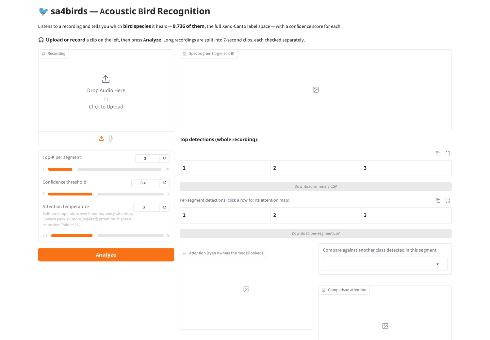
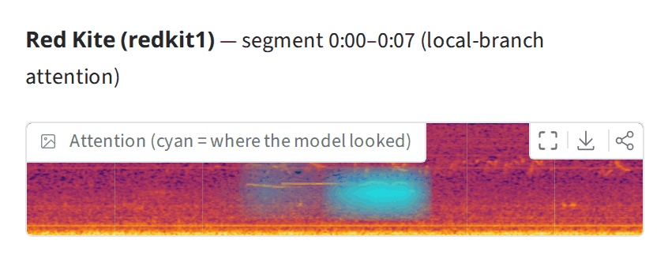

# 🐦 sa4birds — Acoustic Bird Recognition

A web app that listens to a recording and tells you which **bird species** it
hears — **9,736 of them**, the full Xeno-Canto label space — with a confidence
score for each.

It's built on **Spectrogram Attention**, the method introduced in the paper
*Automated Recognition of Bird Species in Environmental Soundscapes Using
Spectrogram Attention*. See the [main project README](../../README.md) for the
research side: training, benchmarks, and checkpoints.

---

## ▶️ Starting it

```bash
./run_app.sh
```

Wait a few seconds — it prints a web address like `http://127.0.0.1:7860`.
Open that in your browser. On Windows, double-click `run_app.bat` instead (see
[On Windows](#-on-windows)).

**First time?** Do [Setup](#️-setup) once, then download the model from the
release — see [Getting a model to serve](#-getting-a-model-to-serve).



## 🎧 Using it

1. **Upload or record** a sound clip on the left.
2. Click **Analyze**.
3. Read the results:


| What you see | What it means |
|---|---|
| 📊 **Spectrogram** | The input sound as a spectrogram: time runs left to right, pitch bottom to top, and brighter means louder |
| 📋 **The detailed table** | Every detection with its timestamp |
| 🔍 **Click any row** | Shows *where* in the sound the model was listening (highlighted in cyan) + plays back just that moment |
| ⚖️ **Compare dropdown** | Put a second guess side by side — handy for checking a likely answer against a runner-up |



*Clicking the Red Kite row highlights the exact call it keyed on — cyan marks
where the model was listening.*

The first two sliders on the left control **how many** results appear and **how
confident** the model must be to show one. 💾 Download buttons under each
table save the results as a spreadsheet (CSV).

**Good to know** 📌 Long recordings are split into 7-second clips, each
checked separately. This is a research aid, not a certified identification
service — use your own judgement, especially for rare species.

---

## 🛠️ Setup

**Recommended — a fresh environment** (needs Python 3.11 or 3.12):

```bash
python3 -m venv venv
./venv/bin/pip install -r requirements.txt
./run_app.sh
```

Light install (no torch): `librosa + numpy + pandas + pillow + onnxruntime +
gradio`. The app runs on [onnxruntime](https://onnxruntime.ai/) and never
imports torch. 🎉

To upload anything other than WAV (mp3, ogg, flac, m4a…) you also need
**ffmpeg**, which Gradio uses to decode them: `sudo apt install ffmpeg` on
Debian/Ubuntu. Without it, WAV files still work and other formats show an
error.

### 🪟 On Windows

1. Install **Python 3.12** from [python.org](https://www.python.org/downloads/)
   (the installer also adds the `py` launcher used below).
2. Install **ffmpeg**, then open a *new* terminal so it is on the PATH:
   ```powershell
   winget install --id Gyan.FFmpeg -e
   ```
3. Get this repository (`git clone`, or **Code → Download ZIP** on GitHub and
   unpack it), open PowerShell in `apps\web` and install:
   ```powershell
   py -3.12 -m venv venv
   .\venv\Scripts\python -m pip install -r requirements.txt
   ```
4. Download the model into the project root:
   ```powershell
   cd ..\..
   curl.exe -LO https://github.com/jab2026/sa4birds/releases/download/v1.0/sa4birds-LT-SSA-onnx.tar
   tar -xf sa4birds-LT-SSA-onnx.tar
   ```
   Write `curl.exe`, not `curl`: in Windows PowerShell, `curl` is a different
   command.
5. Double-click **`apps\web\run_app.bat`**, or run it from the terminal to pass
   the command-line options below, e.g. `.\apps\web\run_app.bat --port 8080`.

On Windows the app runs on the CPU; the GPU notes below are for Linux.

<details>
<summary><b>🐳 Alternative: run it in a container</b></summary>

For hosts where installing the Python dependencies is inconvenient. Everything
lives in [`docker/`](docker/), and it still needs an ONNX export
([how to make one](#-getting-a-model-to-serve)):

```bash
cd docker
SA4BIRDS_MODEL=../../../ckpts/onnx/ssa_LT_seed1 docker compose up --build
```

Then open `http://127.0.0.1:7860`; `SA4BIRDS_PORT=8080` publishes elsewhere.
Stop it with `docker compose down`, passing the same `SA4BIRDS_MODEL` (compose
needs it even to stop) — or use a `.env` file as below.

On a server you'd rather not retype that — put it in a `.env` beside the
compose file, which compose picks up automatically:

```bash
cp .env.example .env     # then edit SA4BIRDS_MODEL
docker compose up --build
```

The **model is mounted, not baked in** (read-only, at `/model`): it's ~580 MB,
it isn't in this repository, and which checkpoint you serve is a runtime
choice. `SA4BIRDS_MODEL` is required, so compose stops with an explanation
rather than starting an app with no weights.

📌 **Mind the relative path.** Compose resolves it against the directory holding
the compose file, so from `docker/` the project root is `../../..`, not `..`. An
absolute path avoids the question.

The image is ~1.3 GB, runs as a non-root user, and reports `healthy` once the
app answers HTTP. GPU needs a rebuild rather than just a flag — see the note at
the bottom of [`docker/docker-compose.yml`](docker/docker-compose.yml).
</details>

### ⚡ GPU support

Optional — it runs fine on CPU. `--device` picks the execution provider:
**auto** (default, uses GPU if available, silently falls back to CPU),
**`--device cuda`** (error instead of falling back, so you know for sure), or
**`--device cpu`**. The startup banner always shows which one is active.

<details>
<summary><b>Installing GPU support (version matching matters)</b></summary>

`pip install onnxruntime-gpu` instead of plain `onnxruntime` — they share an
import name, so install only one. Unlike torch, `onnxruntime-gpu` does **not**
pull a matching CUDA/cuDNN as a pip dependency; you need those present
already. `requirements.txt`'s commented-out GPU block is a known-working combination:
`onnxruntime-gpu==1.20.2` (wants cuDNN 9.\* + CUDA 12.\*) plus matching
`nvidia-*-cu12` packages. `run_app.sh` finds those automatically via
`LD_LIBRARY_PATH`.

Versions drift fast: `onnxruntime-gpu==1.29.0` wants CUDA **13**, and
1.17–1.18 want CUDA 11. If you change the pin, this fails loudly with exactly
which library it wanted:

```bash
LD_LIBRARY_PATH=$(find venv/lib/python3.*/site-packages/nvidia -maxdepth 2 -type d -name lib | paste -sd: -) \
  venv/bin/python -c "import onnxruntime as ort; ort.InferenceSession('path/to/model.onnx', providers=['CUDAExecutionProvider'])"
```

Match the `nvidia-*-cu12` versions to what onnxruntime asks for. Either way
this is never fatal — `--device auto` just falls back to CPU.
</details>

### 🎛️ Command-line options

```bash
./run_app.sh                              # default checkpoint, 127.0.0.1:7860
./run_app.sh --ckpt ../../ckpts/onnx/my_model   # serve a different export
./run_app.sh --device cpu                 # force CPU
./run_app.sh --host 0.0.0.0 --port 8080   # listen on all interfaces
./run_app.sh --share                      # also get a public gradio.live link
```

There's also an **attention temperature** slider in the UI: lower is peakier
(more localized), higher is smoother. It recomputes both the
attention map and the scores, defaulting to what the checkpoint was trained
at.

---

## 📦 Getting a model to serve

The app serves an **ONNX export directory**, not a `.pth` file. None is in the
git repository, but the release has the export this app is built around (LT with
the single-branch SSA head). Extract it from the project root and `./run_app.sh`
finds it with no flags:

```bash
cd ../..
curl -LO https://github.com/jab2026/sa4birds/releases/download/v1.0/sa4birds-LT-SSA-onnx.tar
tar -xf sa4birds-LT-SSA-onnx.tar -C .     # -> ckpts/onnx/ssa_LT_seed1/
```

To serve a different checkpoint, download it ([main README](../../README.md#checkpoints))
and convert it once with the project root's [`export_onnx.py`](../../export_onnx.py)
(that script needs torch; the app doesn't):

```bash
cd ../..
python export_onnx.py --ckpt ckpts/LT/dsa_LT_seed1/models/model.pth \
                      --out ckpts/onnx/my_model --ir-version 9
cd apps/web && ./run_app.sh --ckpt ../../ckpts/onnx/my_model
```

`app.py` looks in `../../ckpts/onnx/ssa_LT_seed1` by default; `--ckpt` serves any other
export. Keep exports on **local disk** — loading one over a network mount can
take minutes instead of seconds, since startup reads the whole weight file.

`export_onnx.py` writes `model.onnx` and `metadata.json` (class names,
spectrogram settings, trained temperature and fuse weight); newer PyTorch
versions also write the weights to a separate `model.onnx.data`, which must
stay next to `model.onnx`. Before exporting, it checks that the model it
exports reproduces the checkpoint's predictions, and stops if they differ by
more than rounding error. `--ir-version 9` keeps the export loadable on a
Raspberry Pi. Both DSA and SSA checkpoints are supported.

<details>
<summary><b>What's in this folder</b></summary>

```
apps/web/
├── app.py               # the Gradio app -- onnxruntime + librosa, no torch
├── run_app.sh           # launcher
├── run_app.bat          # launcher on Windows
├── requirements.txt     # serving deps only, deliberately torch-free
├── docker/              # OPTIONAL container setup (Dockerfile + compose)
├── figures/             # the screenshots above
└── reference/
    └── ebird_taxonomy_v2022.csv   # eBird code -> common name
```

`venv/` appears here once you run Setup.

Everything the app needs to serve a model is here **except the ONNX export
itself**, same as the checkpoint it came from. The model architecture code
(`sa4birds/models/`) lives in the package instead — it's only needed by
`export_onnx.py`, never by the app.

**Bird-only, by design**: the supported checkpoints' 9,736 classes are all
eBird codes, so the app carries no taxon machinery — no per-taxon result tabs,
no class lookup, no taxon filter. It expects every class to be a bird.
</details>
